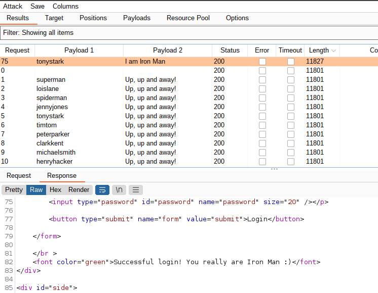

### Web Application 1: *Your Wish is My Command Injection*


* The command injection used was ```127.0.0.1; cat ../../../../etc/passwd && cat ../../../../etc/hosts```. I used a semicolon to allow for the commands to be executed sequentially, irrelevant if the first command was successful or not.
**Preventive** measures would be to create an array of blocked characters, only allowing numbers and periods. We could also implement ```trim()```[^2] to remove any whitespace without modifying the string.


### Web Application 2: *A Brute Force to Be Reckoned With*

* Intercepted the data from bWAPP in Burpsuite and sent the results to ```Intruder``` process. Cleared the auto assigned positions and manually set ```login``` and ```password``` fields for Payload 1 & 2. Set attack type to ```Cluster bomb```.


* Added ```listofadmin.txt``` to ```Payload Set 1``` and ```breached_passwords.txt``` to ```Payload Set 2```. Both Payloads are set to ```Simples list```.


* Analyzed the results, sorting by ```Length```, the login ```ironman``` and password ```I am Iron Man``` resulted in a succesful login. This can be verified under ```Response```.



To help **mitigate** a brute force attack of this nature, it would be recommended to implement **2FA**, **automatic lockout** after X amount of login attempts, paired with a system like **Fail2Ban**[^1], where the IP address would be banned as well.

### Web Application 3: Where's the BeEF?

* Unable to deploy the whole payload due to the message box having a ```maxlength="50"```, changed to ```maxlength="500"```. The full payload was able to be inserted and executed.


* Ran **Social Engineering** >> _Pretty Theft_


* Ran **Social Engineering** >> _Fake Notification Bar_


* Ran **Host** >> _Get Geolocation (Third Party)_


* For **mitigation** techniques, it would be recommended to sanitize data input to prevent code execution, preventing the usage of HTML code.[^3]


#### References:
[^1]: https://www.fail2ban.org/wiki/index.php/Main_Page
[^2]: https://developer.mozilla.org/en-US/docs/Web/JavaScript/Reference/Global_Objects/String/Trim
[^3]: https://www.verizon.com/business/resources/articles/s/how-to-mitigate-cross-site-scripting/