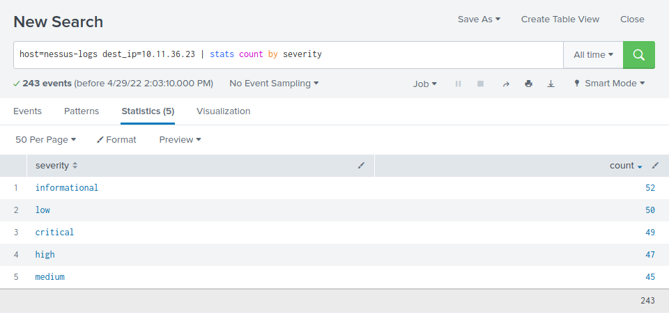
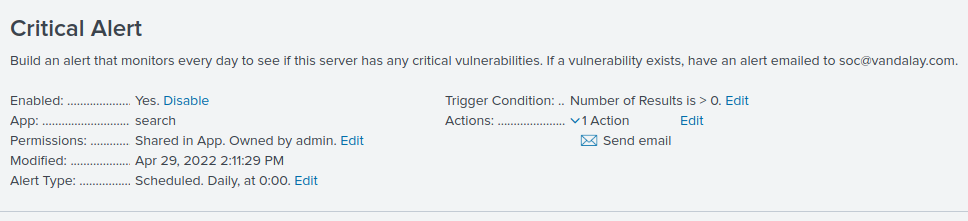
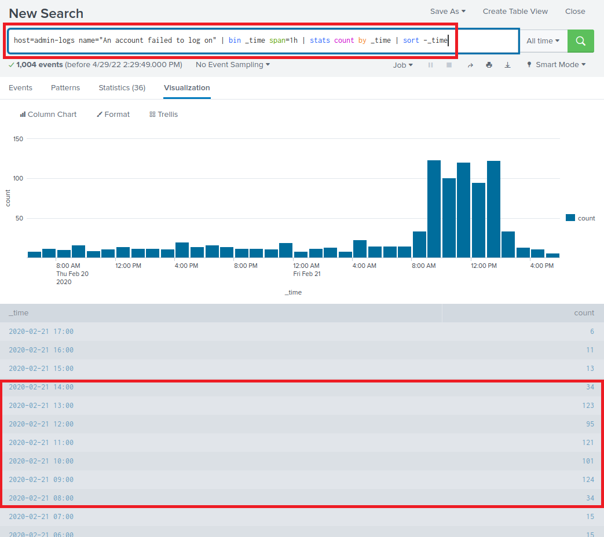
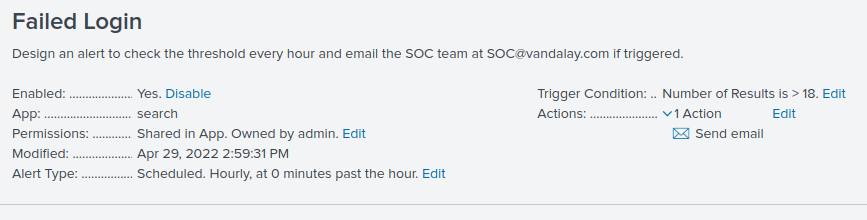

### Step 1: The Need for Speed 

**Background**: As the worldwide leader of importing and exporting, Vandalay Industries has been the target of many adversaries attempting to disrupt their online business. Recently, Vandaly has been experiencing DDOS attacks against their web servers.

Not only were web servers taken offline by a DDOS attack, but upload and download speed were also significantly impacted after the outage. Your networking team provided results of a network speed run around the time of the latest DDOS attack.

**Task:** Create a report to determine the impact that the DDOS attack had on download and upload speed. Additionally, create an additional field to calculate the ratio of the upload speed to the download speed.

* Using the `eval` command, create a field called `ratio` that shows the ratio between the upload and download speeds.
     
* Create a report using the Splunk's `table` command to display the following fields in a statistics report:
    - `_time`
    - `IP_ADDRESS`
    - `DOWNLOAD_MEGABITS`
    - `UPLOAD_MEGABITS`
    - `ratio`
  
   Hint: Use the following format when for the `table` command: `| table fieldA  fieldB fieldC`

##### Answer the following questions:

- Based on the report created, what is the approximate date and time of the attack?
  
> The attack started on 02/23/2020 at 2:30PM.

- How long did it take your systems to recover?

> The attack ended between 10:30PM and 11:30PM, lasting between 8 to 9 hours. 

Submit a screen shot of your report and the answer to the questions above.
 
### Step 2: Are We Vulnerable? 

**Background:**  Due to the frequency of attacks, your manager needs to be sure that sensitive customer data on their servers is not vulnerable. Since Vandalay uses Nessus vulnerability scanners, you have pulled the last 24 hours of scans to see if there are any critical vulnerabilities.

**Task:** Create a report determining how many critical vulnerabilities exist on the customer data server. Then, build an alert to notify your team if a critical vulnerability reappears on this server.

* Create a report that shows the `count` of critical vulnerabilities from the customer database server.
   - The database server IP is `10.11.36.23`.
   - The field that identifies the level of vulnerabilities is `severity`.

      
* Build an alert that monitors every day to see if this server has any critical vulnerabilities. If a vulnerability exists, have an alert emailed to `soc@vandalay.com`.

Submit a screenshot of your report and a screenshot of proof that the alert has been created.

### Step 3: Drawing the (base)line

**Background:**  A Vandaly server is also experiencing brute force attacks into their administrator account. Management would like you to set up monitoring to notify the SOC team if a brute force attack occurs again.

**Task:** Analyze administrator logs that document a brute force attack. Then, create a baseline of the ordinary amount of administrator bad logins and determine a threshold to indicate if a brute force attack is occurring.

* When did the brute force attack occur?

> The brute force attack started at 8AM and continued to 2PM.

      
* Determine a baseline of normal activity and a threshold that would alert if a brute force attack is occurring.

> Removing the brute force attack count, which would skew the average calculation, we can see that the average failed logins at around 12.8, rounded to 13 per hour. The alert should be set to anything greater than 18 failed logins per hour -- giving enough room to avoid false positives.

* Design an alert to check the threshold every hour and email the SOC team at SOC@vandalay.com if triggered. 

Submit the answers to the questions about the brute force timing, baseline and threshold. Additionally, provide a screenshot as proof that the alert has been created.
