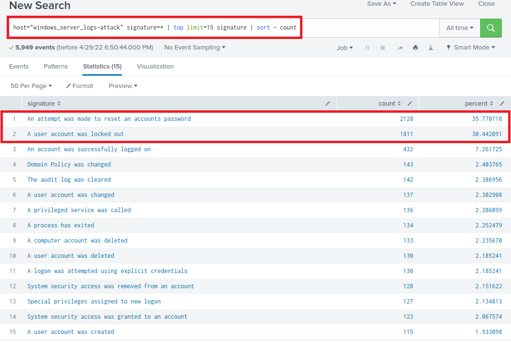
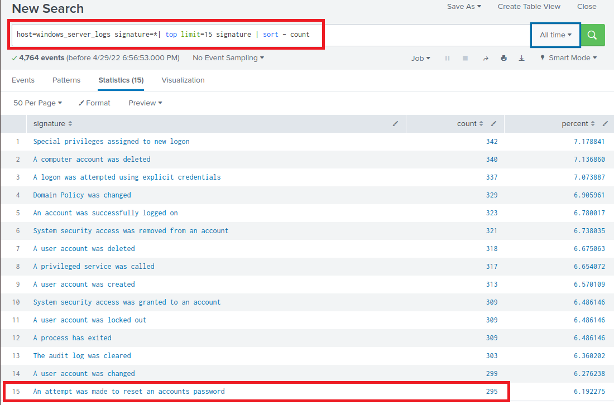

### Part 1: Windows Server Attack

Note: This is a public-facing windows server that VSI employees access.
 
#### Question 1
- Several users were impacted during the attack on March 25th.
- Based on the attack signatures, what mitigations would you recommend to protect each user account? Provide global mitigations that the whole company can use and individual mitigations that are specific to each user.

**Server Attack**

**Baseline normal server usage.**

>By comparing normal server operations to the logs of the attack, we can see that the server was under severe stress. By initiating multiple attempts are resetting the user password, it resulted in the account being locked out. Under normal operations, there were 295 user password reset, under attack it raised to 2128.
>
> Mitigation would include geo-ip block to the area where the company is located, implement a VPN with 2FA using RADIUS. 

  
#### Question 2
- VSI has insider information that JobeCorp attempted to target users by sending "Bad Logins" to lock out every user.
- What sort of mitigation could you use to protect against this?

> I would apply the same mitigation as outlined above. Implement automatic IP ban after several X attempts at logging in.

### Part 2: Apache Webserver Attack:

#### Question 1
- Based on the geographic map, recommend a firewall rule that the networking team should implement.
- Provide a "plain english" description of the rule.
  - For example: "Block all incoming HTTP traffic where the source IP comes from the city of Los Angeles."
- Provide a screen shot of the geographic map that justifies why you created this rule. 
  
#### Question 2

- VSI has insider information that JobeCorp will launch the same webserver attack but use a different IP each time in order to avoid being stopped by the rule you just created.

- What other rules can you create to protect VSI from attacks against your webserver?
  - Conceive of two more rules in "plain english". 
  - Hint: Look for other fields that indicate the attacker.
