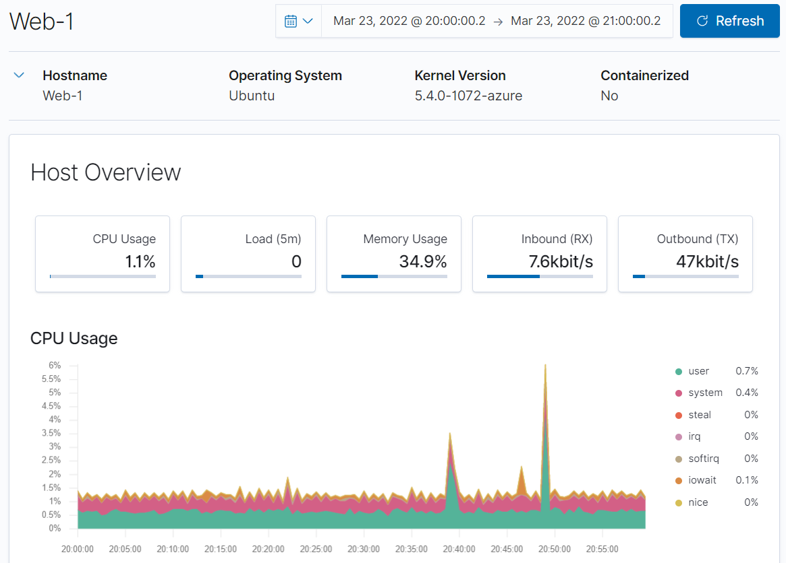
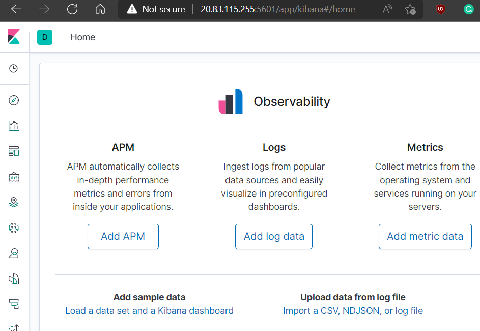

## Automated ELK Stack Deployment

The files in this repository were used to configure the network depicted below.


These files have been tested and used to generate a live ELK deployment on Azure. They can be used to either recreate the entire deployment pictured above. Alternatively, select portions of the playbook file may be used to install only certain pieces of it, such as Filebeat.

 > - **[Filebeat Deployment Ansible Playbook](ansible/filebeat-deploy.yml)**

This document contains the following details:
- Description of the Topology
- Access Policies
- ELK Configuration
  - Beats in Use
  - Machines Being Monitored
- How to Use the Ansible Build


### Description of the Topology

The main purpose of this network is to expose a load-balanced and monitored instance of DVWA, the D*mn Vulnerable Web Application.

Load balancing ensures that the application will be highly redundant and high availability, in addition to restricting access to the network.
- What aspect of security do load balancers protect? 
> A Load Balancer capacity to off-loading excess traffic across multiple servers allows an organization to better defend itself from distributed-denial-of-service. [^1]
- What is the advantage of a jump box?
> A jump server creates a single point connection, that sysadmins can use to manage the entire server network, thus reducing the attack surface by have one point of entry. This can also be considered a weakness, as a poorly configured jump server could potentially expose the entire server cluster. [^2]

Integrating an ELK server allows users to easily monitor the vulnerable VMs for changes to the file system, log aggregation, along with system usage.

- What does Filebeat watch for?
> Filebeat monitors locations and collects log files, including log events. [^3]
- What does Metricbeat record?
> Metricbeat records system-level CPU usage, memory, file system, network statistics, disk IO, and running processes on the system. [^4]

The configuration details of each machine may be found below.

| Name     | Function | IP Address | Operating System |
|----------|----------|------------|------------------|
| Jump Box | Gateway  | 10.0.1.6 | Linux - Ubnt 18.04 LTS |
| Web-1 | Web-Server | 10.0.1.7 | Linux - Ubnt 18.04 LTS |
| Web-2 | Web-Server | 10.0.1.4 | Linux - Ubnt 18.04 LTS |
| Web-3 | Web-Server | 10.0.1.5 | Linux - Ubnt 18.04 LTS |
| Elk-Stack | ELK Stack Server | 10.0.1.8 | Linux - Ubnt 18.04 LTS |

### Access Policies

The machines on the internal network are not exposed to the public Internet. 

Only the **Jump Box** machine can accept connections from the Internet. Access to this machine is only allowed from the following IP addresses:
> - 96.82.204.202 [Corporate Static IP] 

Machines within the network can only be accessed by the **Jump Box** through **SSH**.
- Which machine did you allow to access your ELK VM? What was its IP address?
> **Jump Box** is the only machine that can access the **ELK-Stack VM** through **SSH** with the following IP of **10.0.1.6**. 

A summary of the access policies in place can be found in the table below.

| Name     | Publicly Accessible | Allowed IP Addresses |
|----------|---------------------|----------------------|
| Jump Box | Yes | 96.82.204.202 [Corporate Static IP] |
| Web-1 | No | 10.0.1.6 |
| Web-2 | No | 10.0.1.6 |
| Web-3 | No | 10.0.1.6 |
| ELK-Stack | Yes | 96.82.204.202 [Corporate Static IP] |

### Elk Configuration

Ansible was used to automate configuration of the ELK machine. No configuration was performed manually, which is advantageous because it allows the sysadmin orchestration, deployment and management of server clusters, without having to manage individual servers. [^5]

The **[playbook](ansible/elk-deploy.yml)** implements the following tasks:
- Docker Install
- Package Management System - Python3-pip
- Docker Python3 Install
- Set VM Max MEM Size 
- Deploy ELK Container, exposing ports 5601, 9200 and 5044.
- Enable Docker service

The following screenshot displays the result of running `docker ps` after successfully configuring the ELK instance.


### Target Machines & Beats
This ELK server is configured to monitor the following machines:
> * 10.0.1.4
> * 10.0.1.5
> * 10.0.1.7


We have installed the following Beats on these machines:
> * Filebeat v.7.4.0
> * Metricbeat v.7.4.0

These Beats allow us to collect the following information from each machine:
> * **Filebeat:** Filebeat monitors locations and collects log files, including log events. [^3]


> * **Metricbeat:** Metricbeat records system-level CPU usage, memory, file system, network statistics, disk IO, and running processes on the system. [^4]




### Using the Playbook
In order to use the playbook, you will need to have an Ansible control node already configured. Assuming you have such a control node provisioned: 

SSH into the control node and follow the steps below:
- Copy **[elk-deploy.yml](ansible/elk-deploy.yml)**, **[filebeat-deploy.yml](ansible/filebeat-deploy.yml)** and **[metricbeat-deploy.yml](ansible/metricbeat-deploy.yml)** to ```/etc/ansible```
- Copy **[filebeat-cfg.yml](ansible/filebeat-cfg.yml)** and **[metricbeat-cfg.yml](ansible/metricbeat-cfg.yml)** to ```/etc/ansible/files```
- Update the **hosts** file to include **[Webservers]** server cluster and the **[ELK-Stack]** server.
- Run the playbook, and navigate to **http://20.83.115.255:5601/** to check that the installation worked as expected.




- Which file is the playbook? Where do you copy it?
> Playbook file is **[elk-deploy.yml](ansible/elk-deploy.yml)**, copy the file to ```/etc/ansible```
- Which file do you update to make Ansible run the playbook on a specific machine? How do I specify which machine to install the ELK server on versus which to install Filebeat on?
> Update the **hosts** file in /etc/ansible with the machine IP you wish to deploy the ELK stack (ELK-Stack Server), Filebeat and Metricbeat (Webservers)
- Which URL do you navigate to in order to check that the ELK server is running?
> Navigate on a web browser either to the **internal IP address** of the ELK-Stack server **(e.g. http://10.0.1.8:5601)** or the **public IP** if one is configured **(e.g. http://20.83.115.255:5601/)**.

_As a **Bonus**, provide the specific commands the user will need to run to download the playbook, update the files, etc._

#### References:
[^1]: https://www.nginx.com/resources/glossary/load-balancing/
[^2]: https://www.csoonline.com/article/2612700/security-jump-boxes-improve-security-if-you-set-them-up-right.html
[^3]: https://www.elastic.co/guide/en/beats/filebeat/current/filebeat-overview.html
[^4]: https://www.elastic.co/beats/metricbeat
[^5]: https://staragile.com/blog/what-is-ansible-in-devops
