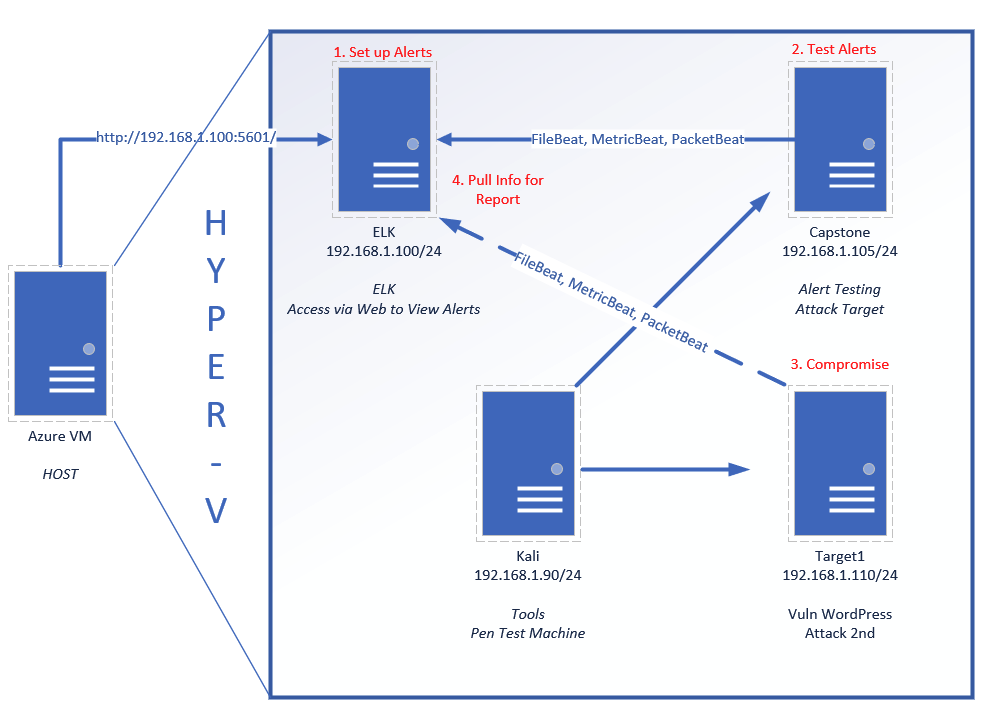
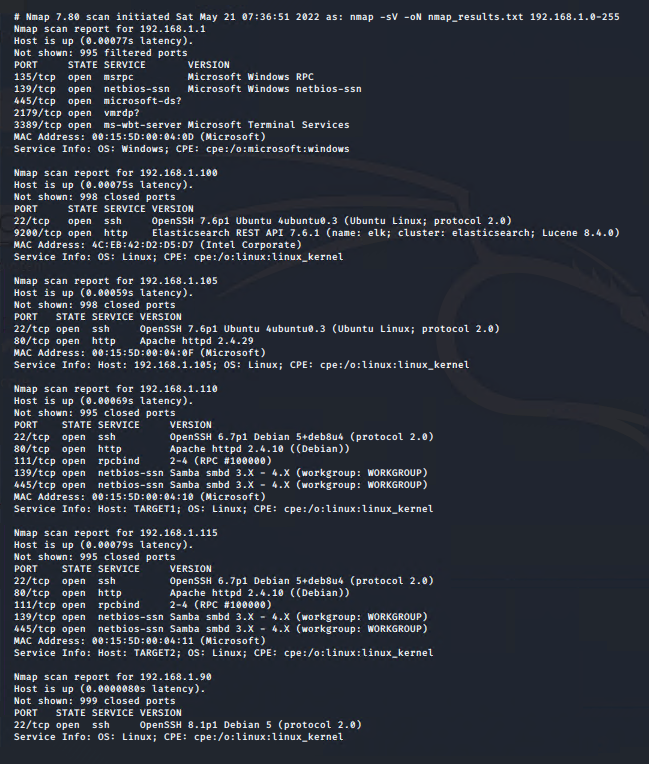
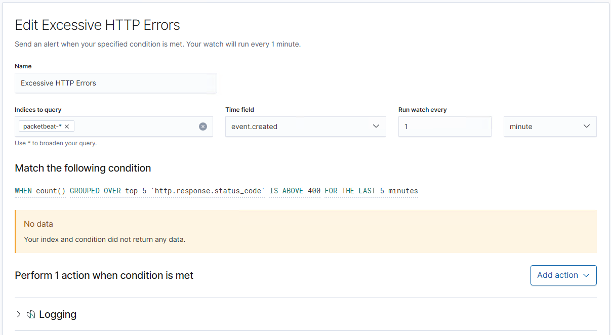
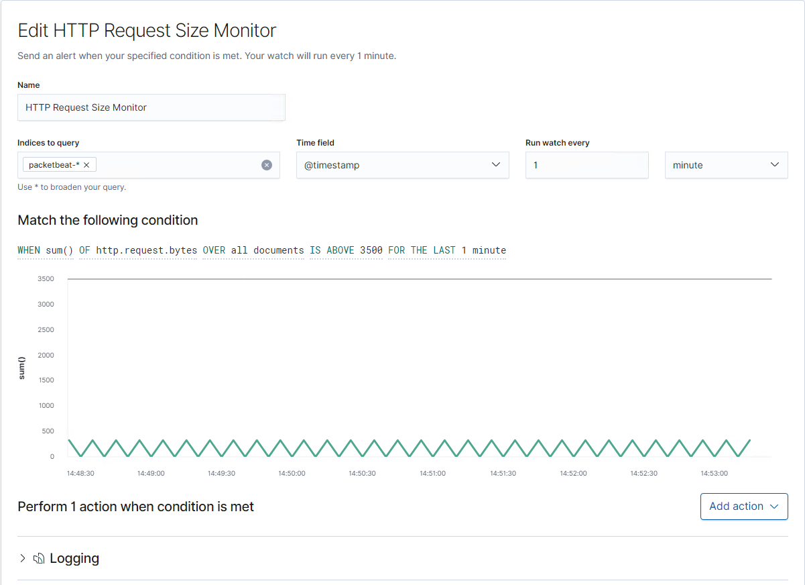
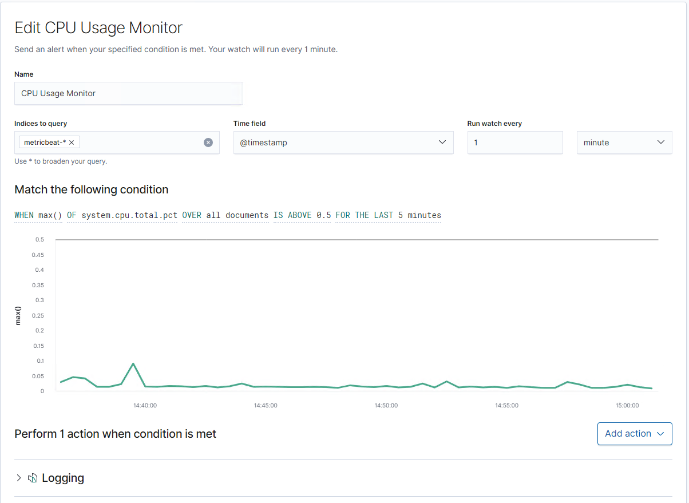

# Blue Team: Summary of Operations

## Table of Contents
- Network Topology
- Description of Targets
- Monitoring the Targets
- Patterns of Traffic & Behavior
- Suggestions for Going Further

### Network Topology


The following machines were identified on the network:
- Capstone
  - **Operating System**: Ubuntu 18.04.1 LTS
  - **Purpose**: Filebeat and Metricbeat are installed and will forward logs to the ELK machine.
  - **IP Address**: 192.168.1.105
- ELK
  - **Operating System**: Ubuntu 10.04.4 LTS
  - **Purpose**:  The same ELK setup that you created in Project 1. It holds the Kibana dashboards.
  - **IP Address**: 192.168.1.100
- Kali
  - **Operating System**: Kali GNU/Linux Rolling
  - **Purpose**:  A standard Kali Linux machine for use in the penetration test on Day 1.
  - **IP Address**: 192.168.1.90
- Target 1
  - **Operating System**: Debian GNU/Linux 8
  - **Purpose**:  Exposes a vulnerable WordPress server.
  - **IP Address**: 192.168.1.110
- ML-RefVm-684427
  - **Operating System**: Windows 10 Pro Version
  - **Purpose**:  Windows Hyper-V Host
  - **IP Address**: 192.168.1.1

### Description of Targets


The target of this attack was: `Target 1` (192.168.1.110).

Target 1 is an Apache web server and has SSH enabled, so ports 80 and 22 are possible ports of entry for attackers. As such, the following alerts have been implemented:

### Monitoring the Targets

Traffic to these services should be carefully monitored. To this end, we have implemented the alerts below:

#### Excessive HTTP Errors

Excessive HTTP Errors is implemented as follows:
  - **Metric**: Total count of the five most common response codes during a 5 minute span.
  - **Threshold**: 400
  - **Vulnerability Mitigated**: Brute forces attacks and Dynamic Denial of Service Attacks.
  - **Reliability**: Medium - This can be a bit noisy when there is are a high number of good requests from legitimate traffic.

#### HTTP Request Size Monitor

HTTP Request Size Monitor is implemented as follows:
  - **Metric**: Total size of request bytes sent for all documents over the last 1 minute.
  - **Threshold**: 3500 bytes
  - **Vulnerability Mitigated**: Prevent unwanted upload of large (binary, etc) files.
  - **Reliability**: Low - It would not take many requests to trigger this alert, so while it could find legitimate malicious traffic, it also will probably trigger a lot of false positives.

#### CPU Usage Monitor

CPU Usage Monitor is implemented as follows:
  - **Metric**: CPU usage as stated as max CPU used over a 5 minute period.
  - **Threshold**: Fifty percent of CPU used over a five minute period.
  - **Vulnerability Mitigated**: Attacks or vulnerabilities that may already exist and are CPU intensive.
  - **Reliability**: Low - There are so many reasons why CPU gets used on a host, and while this could detect malicious activity, it will also trigger a lot of false positives.

_TODO Note: Explain at least 3 alerts. Add more if time allows._

### Suggestions for Going Further (Optional)
- Each alert above pertains to a specific vulnerability/exploit. Recall that alerts only detect malicious behavior, but do not stop it. For each vulnerability/exploit identified by the alerts above, suggest a patch. E.g., implementing a blocklist is an effective tactic against brute-force attacks. It is not necessary to explain _how_ to implement each patch.

The logs and alerts generated during the assessment suggest that this network is susceptible to several active threats, identified by the alerts above. In addition to watching for occurrences of such threats, the network should be hardened against them. The Blue Team suggests that IT implement the fixes below to protect the network:
- HTTP Request Size Monitor (Buffer-Overflow attack)
  - **Patch**: Should update ssh and openssh-server to latest version
  ```
  sudo apt-get update
  sudo apt-get install ssh
  sudo apt-get install openssh-server
  sudo service ssh start
  sudo service ssh stop
  sudo server ssh restart
  ```
  - **Why It Works**: It remediates vulnerabilities that existed in order version of each of the respective packages.

- Excessive HTTP Errors (Brute force attack)
  - **Patch**: Force users to have long passwords that have complex characters.
  - **Why It Works**: In the event a brute force attack happens, such that would trigger an Excessive HTTP Errors alert, this would mitigate the number of successful Account Takeovers (ATOs).

- HTTP Request Size Monitor (File upload)
  - **Patch**: Fix permissions on an exposed directory on the HTTP server.
  - **Why It Works**: This ensure that if a bad actor were able to expose a directory on the HTTP server, they would not be able to upload any files unless they had user or group permissions on that directory.
